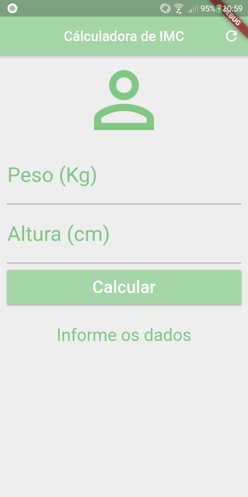

# Calculo de IMC(Índice de Massa Corporal)

## Objetivo

Efetuar o cálculo IMC repassando-se as informações obtidos de um paciente.

## Informações para cálculo:
- Peso do paciente em kg;
- Altura do paciente em cm;

## Resultado:
Aṕos informar os dados do paciente, e pressionar o botão "Calcular", é apresentado uma mensagem informando qual a classificação do IMC o paciente está juntamente com o grau do IMC.

**OBS**:
IMC Calculado com base na seguinte tabela apresentada:

Projeto realizado utilizando-se do framework Flutter, conforme demonstrado pelo prof. Daniel Ciolfi na plataforma Udemy.